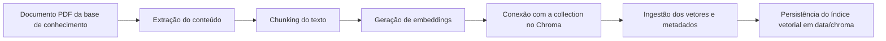
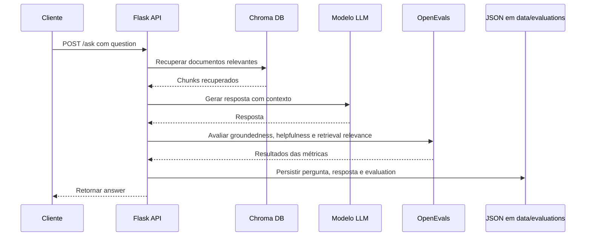

# 📺 INDICADORES DE DESEMPENHO DE MODELOS

> **Fase:** 01 — Fundamentos de ML
**Data:** 2026-03-17
**Professor:** Pedro Almeida
**Tipo:** Live

---

## 📋 Contexto

Este repositório tem como foco apresentar indicadores de avaliação para
sistemas de RAG. A proposta é demonstrar, de forma simples, como uma
base documental pode ser indexada em um banco vetorial local, utilizada
por uma aplicação para responder perguntas e, em seguida, avaliada com
métricas específicas para verificar a qualidade da resposta e da etapa
de recuperação de contexto.

O projeto foi organizado em dois fluxos principais. O primeiro prepara
o índice vetorial a partir do PDF da base de conhecimento. O segundo
expõe uma API Flask que recebe a pergunta do usuário, consulta o Chroma
DB, gera a resposta com LLM e persiste os indicadores de evaluation em
arquivo JSON.

---

## 🎯 Objetivos

- [x] Indexar uma base de conhecimento local em Chroma DB
- [x] Expor uma API Flask para perguntas em linguagem natural
- [x] Persistir resultados de evaluation em JSON

---

## 🛠️ Como Executar

### Pré-requisitos

- Python 3.10+
- Chave de API da OpenAI

Para criar uma chave da **OpenAI**:

1. Acesse `https://platform.openai.com/`
2. Faça login ou crie sua conta
3. Entre em `API keys`
4. Gere uma nova chave
5. Copie a chave e configure no arquivo `.env` (crie o arquivo `.env` com base no `.env.example`)

### Setup

- Clone o repositório e execute:

```bash
# Crie um ambiente virtual
python3 -m venv venv

source venv/bin/activate  # Linux/Mac
# venv\Scripts\Activate   # Windows

# Instale dependências
pip install -r requirements.txt
```

- Crie o arquivo `.env` com base no `.env.example`, como já mencionado
- Preencha a variável `OPEN_AI_KEY` com a sua chave da OpenAI

### Fluxo 1: Indexar

Esse fluxo lê o PDF `data/knowledge_base/ghg-protocol-revised.pdf`,
faz chunking, gera embeddings e persiste os vetores localmente em
`data/chroma/`.



Executar o seguinte script para indexar documetnos vetorizados no Chroma DB.

```bash
python3 ingestion/build_index.py
```

### Fluxo 2: Servir

Esse fluxo expõe uma API Flask com o endpoint `POST /ask`. Durante cada
requisição a aplicação recupera documentos do Chroma DB, gera a resposta
com LLM, executa o evaluation e persiste o resultado em
`data/evaluations/`.

```bash
flask --app src.app run
```



Exemplo de request:

```bash
curl -X POST http://127.0.0.1:5000/ask \
  -H "Content-Type: application/json" \
  -d '{"question":"O que o documento fala sobre escopo 2?"}'
```

Exemplo de response:

```json
{
  "answer": "..."
}
```

Exemplos de perguntas para teste:

**`Como o documento diferencia responsabilidade operacional e responsabilidade econômica pelas emissões em operações compartilhadas?`**

**`Qual metodologia específica o GHG Protocol Corporate Standard define para conduzir auditorias externas de inventários de emissões?`**

**`O GHG Protocol Corporate Standard estabelece regras específicas de como a verificação externa de inventários de emissões deve ser conduzida?`**

---

## 📁 Estrutura

```text
.
├── README.md                 ← Documentação principal
├── .env.example              ← Exemplo de variáveis de ambiente
├── requirements.txt          ← Dependências versionadas do projeto
├── api_client/               ← Collection de exemplo para testar a API
│   └── postman_collection.json
├── ingestion/                ← Fluxo de indexação da base vetorial
│   ├── build_index.py        ← Orquestra a ingestão
│   ├── chunking.py           ← Divide documentos em chunks
│   ├── embeddings.py         ← Configura o modelo de embeddings
│   ├── loaders.py            ← Carrega o PDF da base
│   └── vector_store.py       ← Cria e persiste a collection no Chroma
├── src/                      ← Aplicação principal
│   ├── app.py                ← API Flask com rota /ask
│   ├── config.py             ← Configurações e paths
│   ├── schemas.py            ← Estruturas simples de request e output
│   ├── rag/                  ← Recuperação, prompt e geração
│   └── evaluation/           ← Métricas OpenEvals e persistência
├── data/
│   ├── knowledge_base/       ← Base de conhecimento
│   ├── chroma/               ← Banco vetorial local
│   └── evaluations/          ← Resultados de evaluation
└── .gitignore                ← Arquivos ignorados no Git
```

---

## 📚 Referências

- Chroma DB: https://docs.trychroma.com/docs/overview/getting-started
- LangChain: https://reference.langchain.com/python/langchain-chroma/vectorstores/Chroma
- OpenEvals: https://github.com/langchain-ai/openevals
- LLM-as-a-Judge: https://arxiv.org/abs/2306.05685

---

## 📝 Notas

Cada execução da API gera um arquivo JSON em `data/evaluations/` com a
pergunta, a resposta, os documentos recuperados, as métricas de
evaluation e o timestamp da execução.
